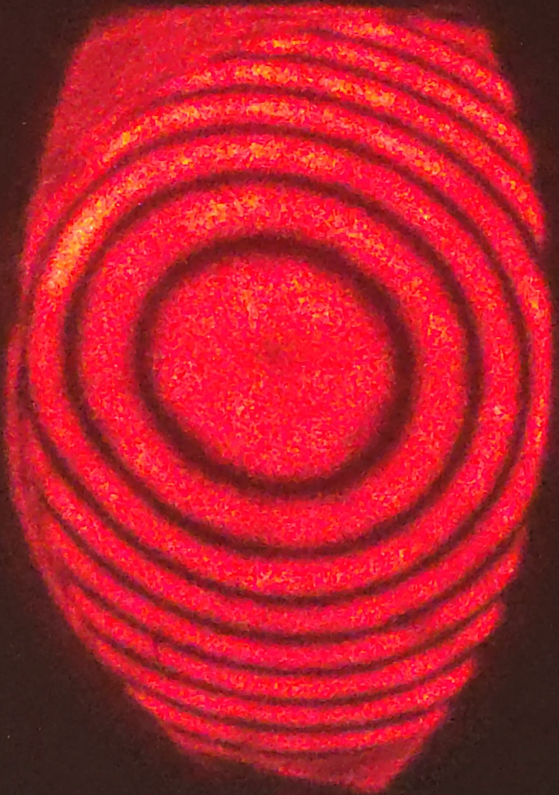
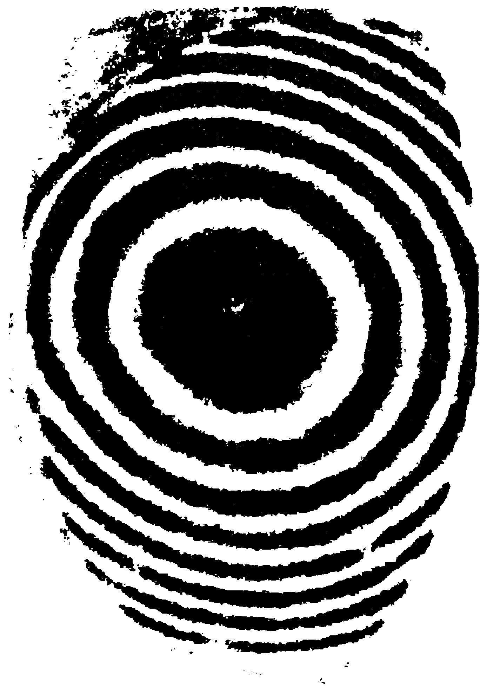
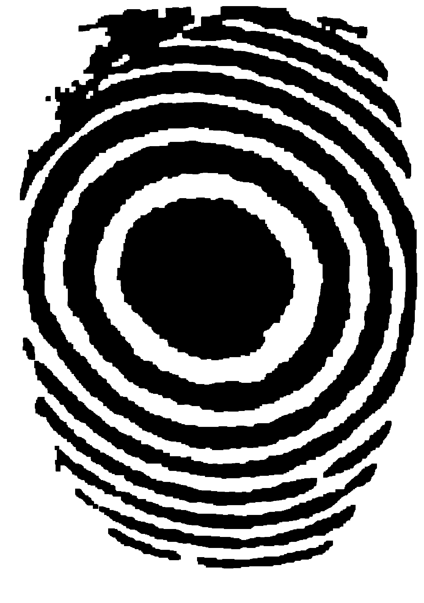
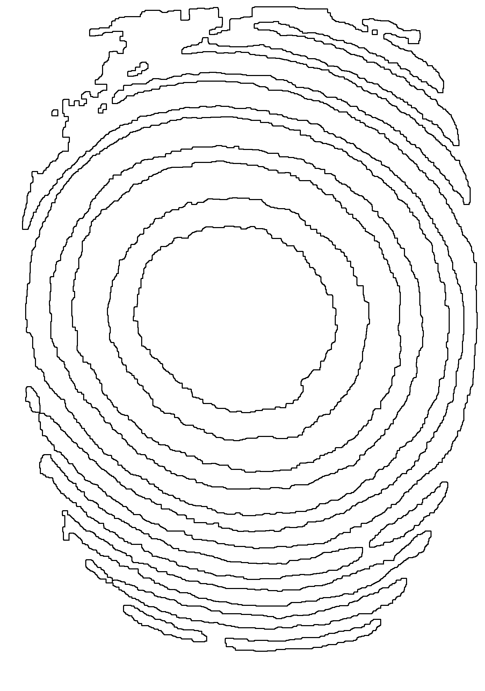
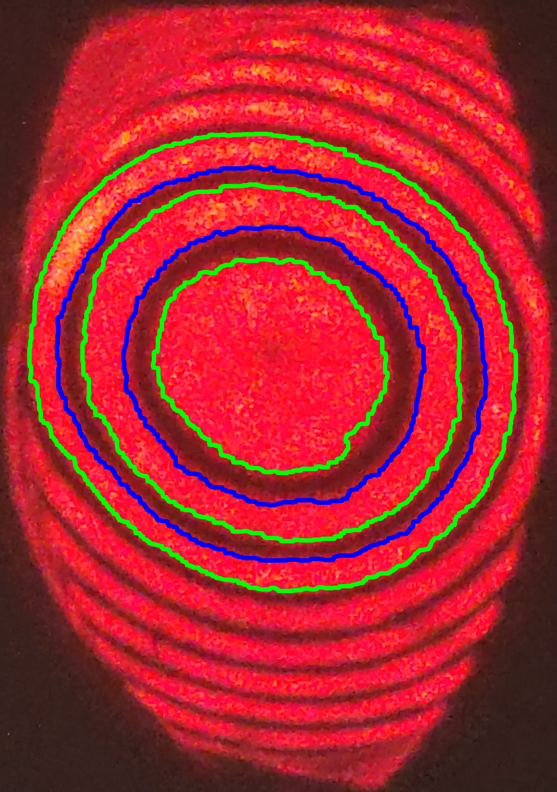
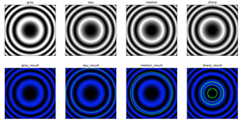
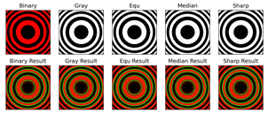
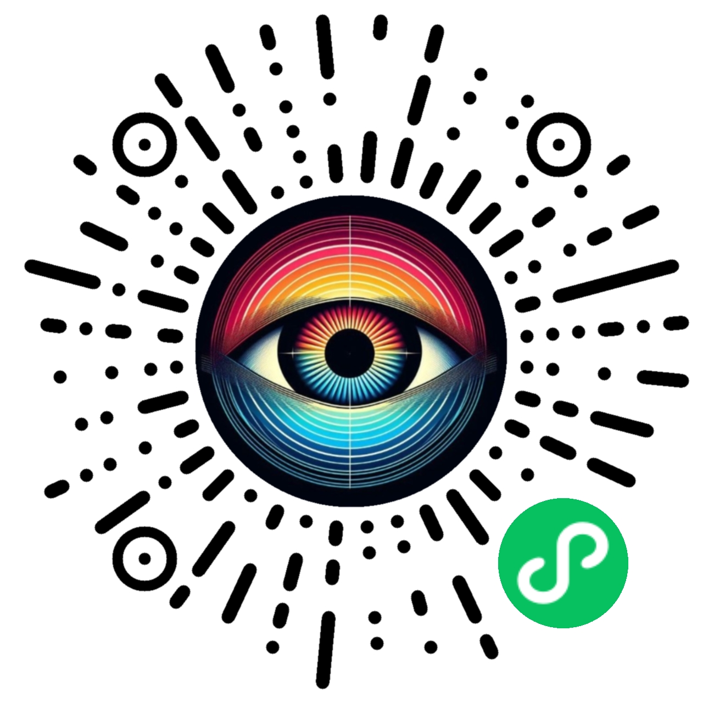

# 仓库说明

```bash
g++ -I/usr/include/opencv4 -o 轮廓检测 轮廓检测.cpp -lopencv_core -lopencv_imgproc -lopencv_videoio -lcurl
```

在迈克尔逊干涉仪实验中，用非定域干涉条纹测量氦氖激光波长时，需要读取干涉条纹中心每吞进或吐出100个暗纹时 $M_1, M_2^\prime$ 的距离差，并记录不少于12个观测点，共约1100次[^4]。在传统的教学实验中，该过程完全由人眼完成。

此前已有基于电路传感器或固定摄像头的智能化计数方法[^1][^2][^3]，但由于成本等因素，没有得到进一步的推广。随着图像识别技术的发展，仅使用非固定的手机摄像头和轻量化的微信小程序即可实现自动计数，这种方式可行性强，易推广。

## 1 实验原理

在迈克尔逊干涉实验中，设光源到光屏总路程为 $Z$，反射镜 $M_1, M_2^\prime$ 的距离为 $d$，则光程差 $\Delta$ 可表示为：

$$ \Delta = 2d \cos{\theta} $$

其中 $ \theta $ 与干涉图像中的圆环半径 $ R $ 满足：

$$ R = Z \tan{\theta} $$

此外由干涉的光强公式：

$$ I_r = 4I_0 \cos^2{\frac{\Delta \phi}{2}} \tag{1} $$

代入得特定波长下光强的分布函数：

$$ I_r = 4I_0 \left( \cos{\frac{2\pi d \cos{\left( \tan^{-1}{\frac{R}{Z}} \right)}}{\lambda}} \right)^2 \tag{2} $$

## 2. 设计过程

辅助程序共包括4个部分：

1. **图像采集部分**
    - 通过微信小程序提供的Api，获取每秒10帧的实时相机图像。

2. **预处理部分**
    - 提取相机图像中的光屏区域，再自适应地计算阈值并进行图像二值化，最后使用形态学方法过滤噪点。

3. **计数部分**
    - 使用Canny边缘检测算法和轮廓识别算法提取图像中的圆环边缘，并根据相邻帧对应边缘面积变化情况判断画面变化趋势，将边缘质心视为干涉图样中心，获取相邻两帧的中心颜色，进而实现圆环自动计数。

4. **渲染部分**
    - 展示处理过程与计数值，用不同颜色标识圆环的内外边缘，并标出干涉图样中心，识别颜色，画面变化趋势以及圆环计数值。

辅助程序使用Python开发，为了使用微信小程序平台，将测试无误的代码手动翻译成C++，并使用Emscripten工具将C++代码编译成Web Assembly格式，以便部署在小程序中。

### 2.1 图像采集部分

总结此前方法，发现基于硬件的采集技术[1] [2] [3]大多没有得到推广。由于手机应用开发的繁琐性，选择微信小程序作为算法部署平台。

微信小程序平台提供了手机摄像头接口，经过真机测验，确认3000万像素以上的摄像头满足计数要求，更多数据将在试推广中获取。

目前小程序已通过审核并上架，计划于本学期的物理实验中首次推广。届时将收集根据型号手机的硬件差异进一步调整算法。

### 2.2 预处理部分

在前期实验模拟中，单次二值化处理即可满足计数要求，但真机测验中发现实验环境的背景亮度，光屏刻度等都会产生噪声。

经反复尝试，选择使用两次二值化处理，并根据实验视频设计自适应的阈值计算算法，提取红色单通道图像中出现频率最高的峰值，选择背景对应峰值后的最低灰度值作为阈值。

- 第一次二值化将较暗的背景与较亮的光屏区域分开，得到光屏区域（见图1）。
- 第二次二值化将明环与暗环分开，使用逆二值化提取出暗环，并采用形态学的开闭操作过滤暗环中的亮点（见图2）。

两次二值化后，图像的边缘清晰，可支持计数部分的边缘检测与轮廓识别（见图3）。



图1 实验视频与有效区域提取



图2 形态学处理前后的二值化图像



图3 边缘识别与轮廓识别图像

### 2.3 计数部分

使用Canny边缘检测算法获取二值化图像的边缘，如图3(左)所示。然后，运用轮廓识别算法提取完整轮廓，过滤轮廓长度小于阈值，或面积大于有效区域最大圆面积的轮廓，其中长度阈值为手动调整参数，受像素值影响。

获取轮廓后，按照其相对亮环的位置分为两类(用蓝色标注内边缘，绿色标注外边缘)。判断轮廓类型时，巧妙利用Opencv的轮廓绘制函数，在空白画布上绘制较粗的轮廓，在另一空白画布上绘制填充轮廓区域，两者的交集就是轮廓的内部邻域。计算该邻域的平均像素值，设置亮度阈值，可获取该轮廓内部邻域的颜色，进而判断轮廓类型。

获取轮廓类型后，将相邻2帧同类型轮廓按照面积差距两两配对，面积差距阈值同样为手动调整参数，受像素值影响。

由于手机摄像头对焦问题，存在部分模糊帧，这些帧即使人眼观察也无法分辨明环暗环。此外，在环境亮度较高的情况下，会存在轮廓漏测问题。为了提高算法鲁棒性，计数算法只需要相邻2帧至少有一对匹配轮廓即可进行。

在已知至少一对匹配轮廓的情况下，可以根据其面积差判断当前亮环向外扩张还是向内收缩，还可以计算轮廓质心，作为干涉图样的中心。选取中心附近一定范围的像素点，计算平均强度，判断中心颜色。

在已获取画面变化趋势和中心颜色变化的情况下，针对两种不同计数模式设计算法：

- 对于扩张计数模式，当一个亮环从中心完全出现时，计数值增加；若因为画面抖动，导致它从环状退回圆状，计数值减少。具体的，当干涉图样的中心由红色变为黑色，且画面呈扩张趋势时，计数值增加；当干涉中心由黑色变为红色，且画面呈收缩趋势时，计数值减小。
- 收缩计数模式与之类似。实际上，有一个统一的算法：中心颜色由红色变为黑色时，若画面变化趋势与当前计数模式相同，增加计数值；黑色变为红色时，若画面变化趋势与当前计数模式相反，减少计数值。

通过计数值的增加和减少判定，可以最大程度的减少漏测，并排除圆环抖动对计数值的影响。在实际测验时，发现极少数情况下，仍存在误测，但考虑到相邻测量点间需要计数50至100个圆环，该误差在允许范围内。

### 2.4 渲染部分

为了可视化计数过程，将识别到的轮廓以不同颜色输出到原始图像上，如图3(右)所示。

在小程序中，仅一个页面且整个页面均为摄像区域，页面的左上角通过浮动框显示处理后的有效区域图像，页面的右上角通过浮动框显示各计数值，包括画面趋势扩张、收缩和未知占比，累计圆环数和当前处理延迟。

页面的底部为控制部分，中间的按钮控制计数开始与暂停，左侧按钮控制计数值的清零，右侧按钮将弹出设置框，控制手动调整参数。

## 3. 研究过程

在前期研究中提出了多条技术路线，但在实际场景中，只有最后一种表现良好。

### 3.1 预处理部分

在预处理部分，大致可以分为两种思路：基于滤波器的思路与基于形态学操作的思路。

早期采用滤波器思路，尝试了中值滤波，高斯滤波等，效果均不明显，因为我们预处理的目标是提取图像边缘进而提取轮廓，而滤波器会损失图像精度，尽管它们确实能快速消除噪声，但也增加了二值化的难度。下图分别为灰度化，均值滤波，中值滤波和锐度化处理：



可见，即使在简单的模拟图像上，滤波器预处理也无法突出边缘，轮廓识别不稳定。

中期，尝试直接进行二值化，结合滤波器使用，效果见下图：



仅二值化处理后即可识别所有轮廓，各种滤波器算法对结果无影响。在此基础上，设计了第一版小程序，通过摄像头识别屏幕上播放的模拟视频，可以稳定计数。但实验环境下，由于背景颜色复杂，画面至少包含背景颜色，光屏暗环颜色，光屏亮环颜色这三种颜色，单次二值化处理不可能完全区分这三种颜色。

然后，在单次二值化的基础上，引入分次全局二值化，效果较好，但图像上有大量肉眼难以分辨的噪点，这些噪点可能干扰有效区域提取和之后的边缘提取。

为了消除噪点，使用了腐蚀和膨胀的形态学操作。腐蚀操作通过将图像中的每个像素值替换为其邻域内的最小值，从而缩小前景对象（通常是白色区域）。膨胀操作通过将图像中的每个像素值替换为其邻域内的最大值，从而扩大前景对象。具体来说，腐蚀会使前景对象的边界向内收缩，去除小的白色噪声点，膨胀会使前景对象的边界向外扩展，填补小的黑色孔洞。

先腐蚀后膨胀被称为一次开运算，可以平滑图像边界，去除小噪声；先膨胀后腐蚀被称为一次闭运算，用于填补小孔洞。通过开运算和闭运算，可以消除亮环和暗环上的噪点，使其轮廓更完整。形态学处理前后见图2。

形态学处理的计算时间随着邻域大小增加呈指数增长，经过手动调整，发现第一次二值化后，大部分情况下选择5x5的邻域范围足以定位有效区域，极少数情况下残留噪点会干扰有效区域生成，导致当前帧面积远大于上一帧面积，暂时扩展到7x7的邻域范围可排除。若推广后发现进一步的扩展需求，可以在此基础上实现自动扩展形态学处理邻域。第二次二值化的形态学邻域选择只能手动调整，目前明确9x9邻域可基本完成识别要求，13x13邻域及以上对效果提升不明显。

二值化阈值的选取会严重影响处理效果。为了获取合适的二值化阈值，尝试了各种自适应算法，结合真实场景视频中的红色频道光强分布，选择使用全局二值化算法，并通过提取峰值，以峰值间的低谷为阈值获取有效区域。考虑到有效区域形状不规则，额外设计了掩码矩阵，以准确描述有效区域。

最终，我们选择了分次二值化和形态学操作的组合方法，放弃了各种滤波器。这种方法在实际应用中表现出色，能够有效提取图像边缘并去除噪声。

### 3.2 计数部分

在计数阶段，我们比较了两种技术路线：霍夫圆检测和Canny边缘检测+轮廓识别[^5]。

霍夫圆检测算法通过在参数空间中寻找圆的参数（圆心和半径），从而检测图像中的圆形对象。该算法理论上可以检测出图像中的所有圆。在实验中，霍夫圆检测算法能够识别出一些圆形对象，但对于有色圆环的效果有限，该算法容易受到噪声干扰，产生大量误检。

Canny边缘检测通过计算图像梯度，检测出像素变化超过阈值的边缘点。由于图像已经二值化，此处阈值的选取对结果无影响。获取边缘点后，通过轮廓识别算法，将这些边缘点连接成完整的轮廓。经验证，Canny边缘检测+轮廓识别能够有效识别出真实环境下的圆环边缘。图3(左)为对预处理二值化图像进行Canny边缘检测的输出，图3(右)为轮廓识别的结果。

最终，我们选择了Canny边缘检测和轮廓识别的组合方法，放弃了霍夫圆检测算法。这种方法在噪声环境下表现良好，能够准确识别圆形轮廓。

### 3.3 训练数据获取部分

在早期研究中，由于缺少实验环境，基于[^6]提供的MATLAB代码构建了干涉图样的光强分布图。通过该代码可以生成各种波长的衍射图样，图样形如图5中的原始图像，几乎不含噪声。

在第一版微信小程序完成后，在实验室中验证了该算法，发现几乎无法完成计数。录制真实场景视频后，开发了第二版小程序。第二版程序的算法已经在视频上进行了验证，还未进行实验室验证。

## 4 程序部署

在前期研究中，为了实时观察运行结果，选择Python语言，Jupyter Notebook开发。算法测试完成后，需要移植到微信小程序平台上，常见的做法为通过服务器处理，但考虑到图像识别任务即时性强，且服务器成本较高，选择将Python翻译成JavaScript代码，直接运行在本机上。

在原始算法中，使用了OpenCV库和numpy库，以及scipy库提供的find_peaks算法。为了移植到JavaScript中，需要先将Python代码翻译成C++，再编译成JS可读取的Web Assembly代码。JS代码已作为微信小程序的一部分发布，其他中间代码在附录中。

微信小程序第一版已通过审核并发布，可搜索“迈克尔逊干涉仪图像识别”或扫描以下二维码：



[^1]: Ji_HangWei.对迈克尔逊干涉仪实验的一些思考与改进[EB/OL].[https://www.doc88.com/p-89299574164018.html](https://www.doc88.com/p-89299574164018.html)，2016-03-16.

[^2]: 鲁晓东.迈克尔逊干涉条纹的计算机采集与处理[J].实验室研究与探索,2009,28(11):47-49+105.

[^3]: 宾峰,邓敏,唐付桥,任桂香,刚煜,杨奇武,温建,王永建,唐立军.迈克尔逊干涉条纹自动测量方法[J].光学与光电技术,2015,13(04):36-40.

[^4]: 李忠明,唐延甫,李俊霖等.迈克尔逊干涉条纹位移信息提取研究[J].电子测量技术,2021,44(05):51-54.DOI:10.19651/j.cnki.emt.2105820.

[^5]: baiding.多级圆环的几种检测方法[EB/OL].1,2020-12-20.,[https://baiding72.gitee.io/2020/12/20/multiplecircle](https://baiding72.gitee.io/2020/12/20/multiplecircle)

[^6]: caaaamel.MATLAB仿真：迈克尔逊干涉仪动态仿真[EB/OL].https://zhuanlan.zhihu.com/p/61569780
